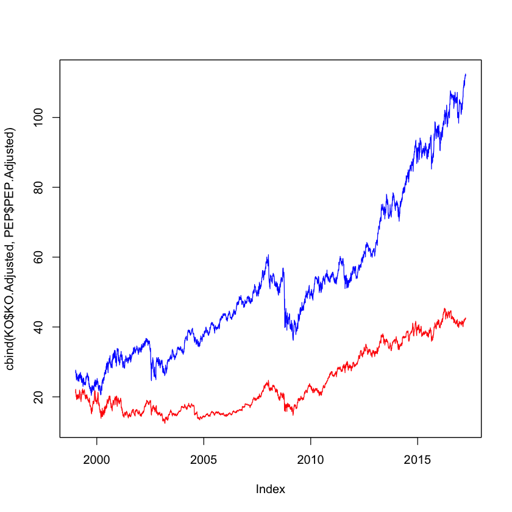
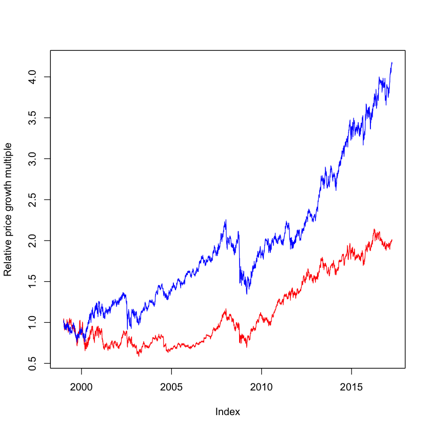
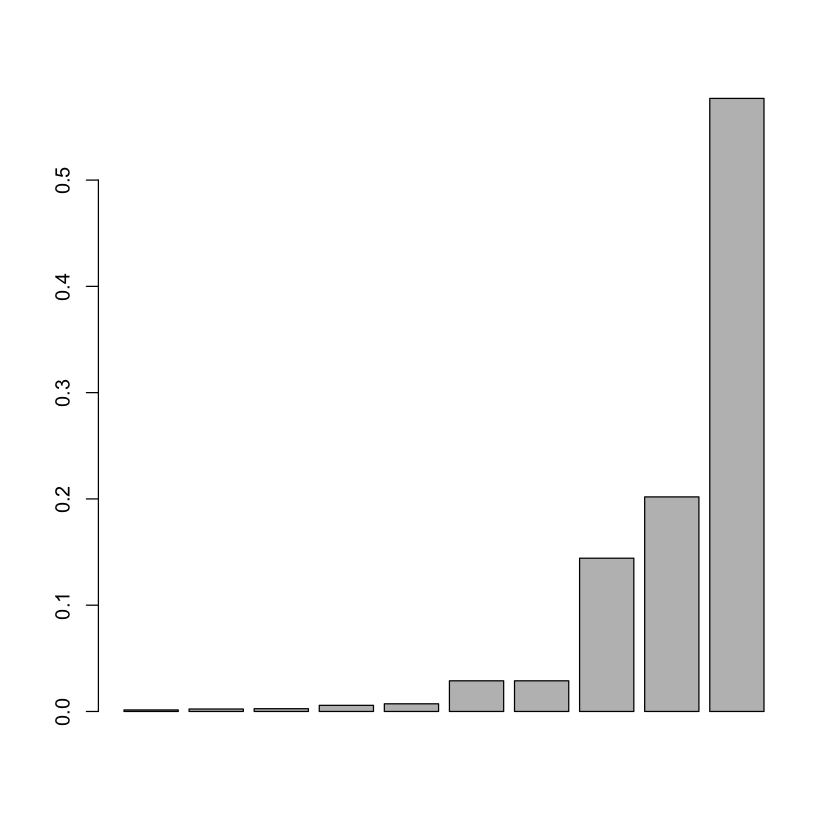
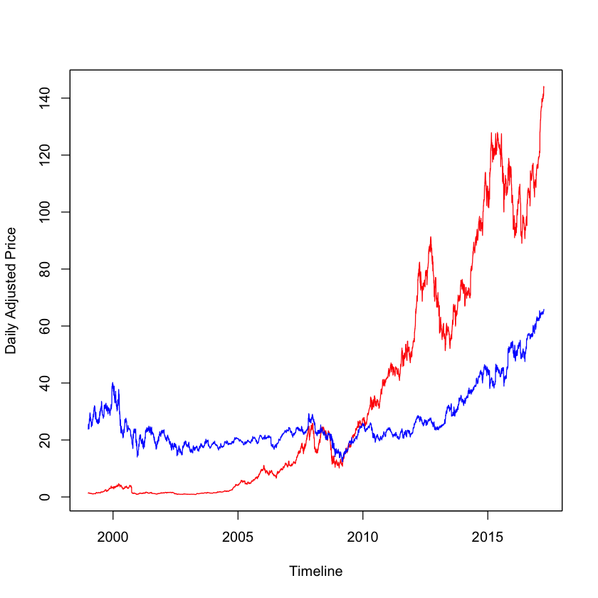
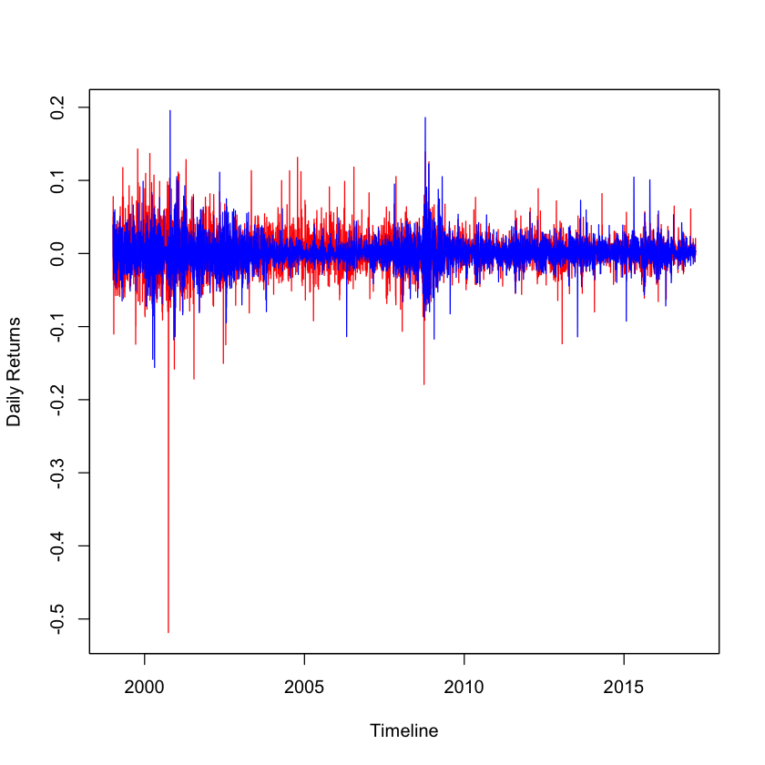
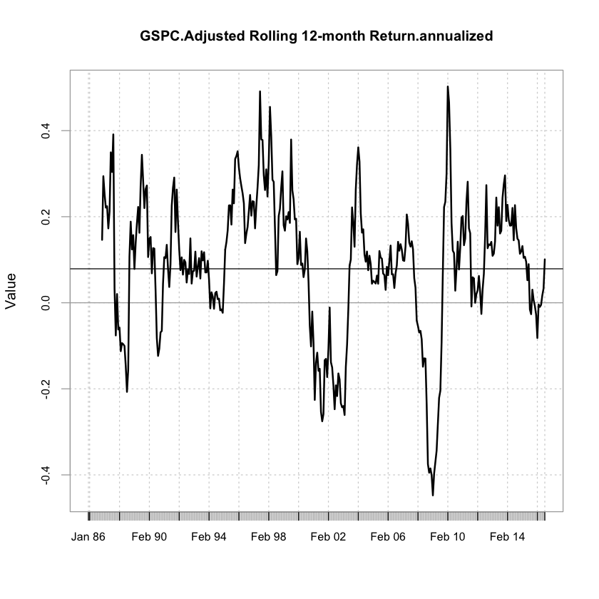
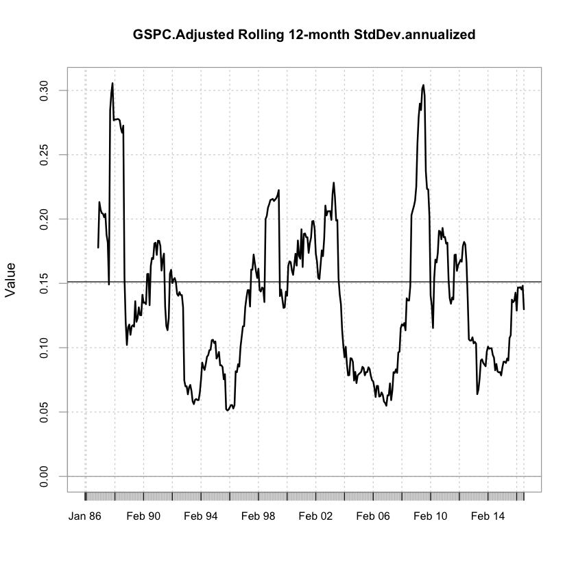
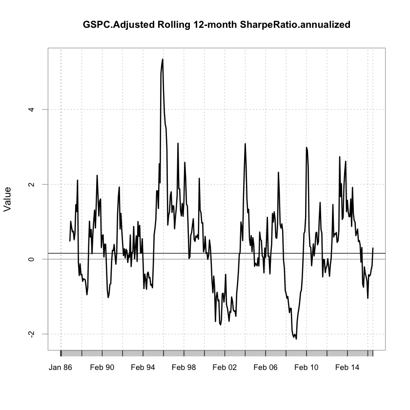
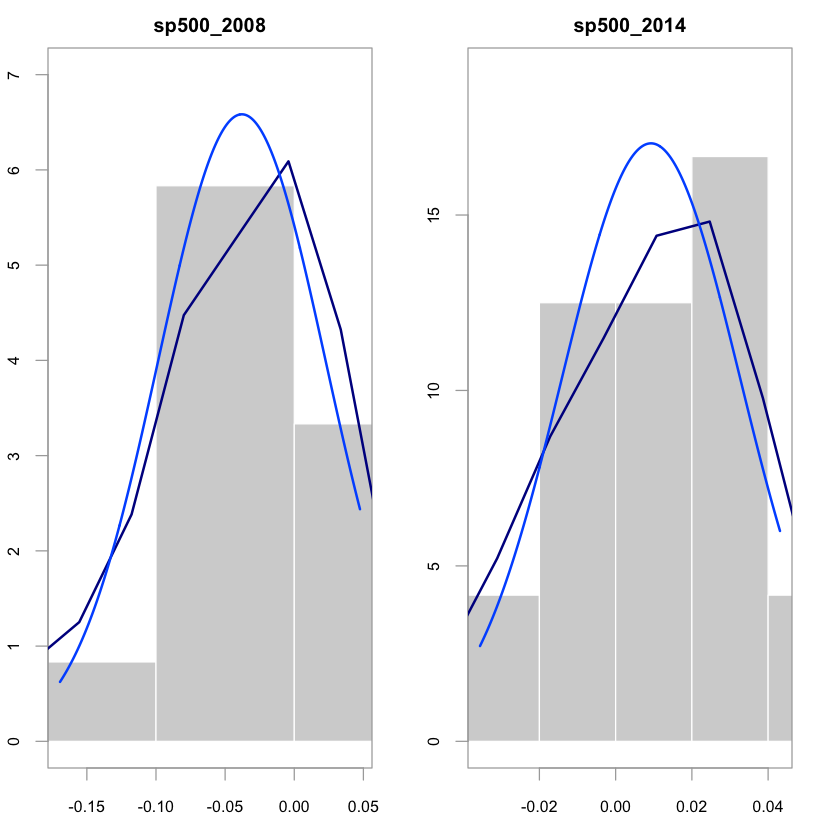
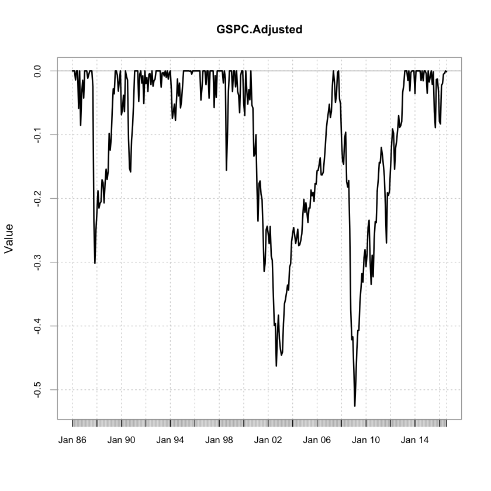

## Introductory Portfolio Optimization - Part 1

#### In this first of the 2 part series on Introductory Portfolio Optimization, we begin with the basics of analyzing the prices and returns of stocks/indexes, converting the scales of time series to monthly/yearly etc, calculating portfolio weights, understanding the return distributions, and calculating different measures of quantifying risk and reward of portfolios. I will also be highligting some key features of the R package PerformanceAnalytics as I go through thse steps.


```R
library(quantmod);library(PerformanceAnalytics); library(zoo); library(xts);library(ggplot2)
```


```R
dataEnv<-new.env()
getSymbols(c("^GSPC","KO","PEP"), from = "1999-01-01", to = "2017-03-31")
```

    Warning message in download.file(paste(yahoo.URL, "s=", Symbols.name, "&a=", from.m, :
    “"internal" method cannot handle https redirection to: 'https://ichart.finance.yahoo.com/table.csv?s=^GSPC&a=0&b=01&c=1999&d=2&e=31&f=2017&g=d&q=q&y=0&z=^GSPC&x=.csv'”Warning message in download.file(paste(yahoo.URL, "s=", Symbols.name, "&a=", from.m, :
    “"internal" method cannot handle https redirection to: 'https://ichart.finance.yahoo.com/table.csv?s=KO&a=0&b=01&c=1999&d=2&e=31&f=2017&g=d&q=q&y=0&z=KO&x=.csv'”Warning message in download.file(paste(yahoo.URL, "s=", Symbols.name, "&a=", from.m, :
    “"internal" method cannot handle https redirection to: 'https://ichart.finance.yahoo.com/table.csv?s=PEP&a=0&b=01&c=1999&d=2&e=31&f=2017&g=d&q=q&y=0&z=PEP&x=.csv'”


<ol class=list-inline>
	<li>'GSPC'</li>
	<li>'KO'</li>
	<li>'PEP'</li>
</ol>


The choice of investment matters even when the underlying risky assets are similar. Lets look at the Cola wars in action  As a first example, let us consider the stock price of the Coca Cola Company and the PepsiCo company from January 1999, until the end of March 2017.
  
Let's first plot the time series for both the stocks. Hopefully I dont need to put the color legend and should be self explanatory :)


```R
plot.zoo(cbind(KO$KO.Adjusted, PEP$PEP.Adjusted), 
         plot.type = "single", 
         col = c("red", "blue"))
```





The next time series plot shows you the value evolution of one dollar invested in each company. As an exercise, plot the time series showing the relative value of an investment in the Coca Cola company, compared to the value of an investment in PepsiCo. To do this exercise, you can use the corresponding price series, available as the variables ko and pep in your workspace.


```R
plot.zoo(cbind(KO$KO.Adjusted/as.numeric(KO$KO.Adjusted[1]), PEP$PEP.Adjusted/as.numeric(PEP$PEP.Adjusted[1])), 
         plot.type = "single", 
         col = c("red", "blue"), ylab = "Relative price growth multiple")
```





As the next step, plot the time series showing the relative value of an investment in the Coca Cola company, compared to the value of an investment in PepsiCo.


```R
ko_pep <- KO$KO.Adjusted/PEP$PEP.Adjusted
plot.zoo(ko_pep)
abline(h = 1)
```


### Portfolio Weights

#### Calculating portfolio weights when component values are given

In this exercise you will learn to calculate weights when individual asset values are given! For this example, an investor has 4000 USD invested in equities, 4000 USD invested in bonds, and 2000 USD invested in commodities. Compute the weights as the proportion invested in each of those three assets.


```R
# Define the vector values
values <- c(4000,4000,2000)

# Define the vector weights
weights <- values/sum(values)

# Print the resulting weights
print(weights)

```

    [1] 0.4 0.4 0.2


#### Market Capitalization Weighted Portfolio

In a market capitalization weighted portfolio, the weights are given by the individual assets' market capitalization (or market value), divided by the sum of the market capitalizations of all assets. A typical example is the S&P 500 portfolio invested in the 500 largest companies listed on the US stock exchanges (NYSE, Nasdaq). Note that by dividing by the sum of asset values across all portfolio assets, the portfolio weights sum to unity (one).

As an exercise, inspect the distribution of market capitalization based weights when the portfolio is invested in 10 stocks. For this exercise you can use market capitalizations of 5, 8, 9, 20, 25, 100, 100, 500, 700 and 2000 million USD.


```R
# Define marketcaps
marketcaps <- c( 5, 8, 9, 20, 25, 100, 100, 500, 700 , 2000)

# Compute the weights
weights <- marketcaps/sum(marketcaps)

# Inspect summary statistics
summary(weights)

# Create a barplot of weights
  barplot(weights)

```


        Min.  1st Qu.   Median     Mean  3rd Qu.     Max. 
    0.001442 0.003389 0.018030 0.100000 0.115400 0.576900 





### Portfolio Returns

For your first exercise on calculating portfolio returns, you will verify that a portfolio return can be computed as the weighted average of the portfolio component returns. In other words, this means that a portfolio return is calculated by taking the sum of simple returns multiplied by the portfolio weights. Remember that simple returns are calculated as the final value minus the initial value, divided by initial value.

Assume that you invested in three assets. Their initial values are 1000 USD, 5000 USD, 2000 USD respectively. Over time, the values change to 1100 USD, 4500 USD, and 3000 USD.


```R
 ##############
  # Exercise 4
  #############

  # Vector of initial value of the assets
  in_values <- c(1000,5000,2000)

  # Vector of final values of the assets
  fin_values <- c(1100,4500,3000)

  # Weights as the proportion of total value invested in each assets
  weights <- in_values/sum(in_values)

  # Vector of simple returns of the assets
  returns <- (fin_values - in_values)/in_values

  # Compute portfolio return using the portfolio return formula
  preturns <- sum(weights*returns)
  preturns
```


0.075


Lets now get real and have some fun comparing the tech giants AAPL and Mr Softy (MSFT). We will get the symbol data as earlier. We use the function Return.calculate from the package PerformanceAnalytics


```R
getSymbols(c("AAPL","MSFT"), from = "1999-01-01", to = "2017-03-31")
prices = cbind(AAPL$AAPL.Adjusted,MSFT$MSFT.Adjusted)

# Print the first and last six rows of prices
 head(prices)
 tail(prices)


# Create the variable returns using Return.calculate()  
 returns <- Return.calculate(prices) 
  
# Print the first six rows of returns. Note that the first observation is NA, because there is no prior price.
head(returns)
tail(returns)
```

    Warning message in download.file(paste(yahoo.URL, "s=", Symbols.name, "&a=", from.m, :
    “"internal" method cannot handle https redirection to: 'https://ichart.finance.yahoo.com/table.csv?s=AAPL&a=0&b=01&c=1999&d=2&e=31&f=2017&g=d&q=q&y=0&z=AAPL&x=.csv'”Warning message in download.file(paste(yahoo.URL, "s=", Symbols.name, "&a=", from.m, :
    “"internal" method cannot handle https redirection to: 'https://ichart.finance.yahoo.com/table.csv?s=MSFT&a=0&b=01&c=1999&d=2&e=31&f=2017&g=d&q=q&y=0&z=MSFT&x=.csv'”


<ol class=list-inline>
	<li>'AAPL'</li>
	<li>'MSFT'</li>
</ol>


               AAPL.Adjusted MSFT.Adjusted
    1999-01-04      1.336083      23.79060
    1999-01-05      1.402887      24.71860
    1999-01-06      1.352278      25.52005
    1999-01-07      1.457545      25.39351
    1999-01-08      1.457545      25.28805
    1999-01-11      1.485886      24.88733


               AAPL.Adjusted MSFT.Adjusted
    2017-03-24        140.64         64.98
    2017-03-27        140.88         65.10
    2017-03-28        143.80         65.29
    2017-03-29        144.12         65.47
    2017-03-30        143.93         65.71
    2017-03-31        143.66         65.86


               AAPL.Adjusted MSFT.Adjusted
    1999-01-04            NA            NA
    1999-01-05    0.04999989   0.039007092
    1999-01-06   -0.03607489   0.032423197
    1999-01-07    0.07784420  -0.004958688
    1999-01-08    0.00000000  -0.004152833
    1999-01-11    0.01944434  -0.015846534


               AAPL.Adjusted MSFT.Adjusted
    2017-03-24  -0.001986936   0.001695699
    2017-03-27   0.001706527   0.001846645
    2017-03-28   0.020726845   0.002918633
    2017-03-29   0.002225257   0.002756931
    2017-03-30  -0.001318360   0.003665771
    2017-03-31  -0.001875836   0.002282788


#### Plotting the daily adjusted time-series. (AAPL - Red, MSFT - Blue)


```R
plot.zoo(prices, 
         plot.type = "single", 
         col = c("red", "blue"), superpose = TRUE, xlab="Timeline", ylab="Daily Adjusted Price")
```





#### Plotting the daily returns. (AAPL - Red, MSFT - Blue)


```R
plot.zoo(returns, 
         plot.type = "single", 
         col = c("red", "blue"), superpose = TRUE, xlab="Timeline", ylab="Daily Returns")
```





### Portfolio Weigting Strategies

Next we will create two portfolios using the return series we just created. The two portfolios will differ in one way, and that is the weighting of the assets.

There are two weighting strategies: **the buy and hold strategy**, and a **monthly rebalancing strategy**. In this exercise we will create a portfolio in which we don’t rebalance, and one where we rebalance monthly. We will use the function Return.portfolio() for your calculations. Finally we will then visualize the portfolio returns of both


```R
# Create the weights
eq_weights <- c(0.5, 0.5)

# Create a portfolio using buy and hold
pf_bh <- Return.portfolio(R = returns, weights = eq_weights)

# Create a portfolio rebalancing monthly 
pf_rebal <- Return.portfolio(R = returns, weights = eq_weights, rebalance_on = "months")

# Plot the time-series
par(mfrow = c(2, 1), mar = c(2, 4, 2, 2))
plot.zoo(pf_bh)
plot.zoo(pf_rebal)
```


In the previous step we explored functionality of the Return.portfolio() function and created portfolios using two strategies. However, by setting the argument verbose = TRUE in Return.portfolio() we can create a list of beginning of period (BOP) and end of period (EOP) weights and values in addition to the portfolio returns, and contributions.

You can access these from the resultant list-object created from Return.portfolio(). The resultant list contains \\$returns, \$contributions, \$BOP.Weight, \$EOP.Weight, \$BOP.Value, and \$EOP.Value.

In the next step we will recreate the portfolios made in the last step but extend it by creating a list of calculations using verbose = TRUE. We will then visualize the end of period weights of Apple.


```R
# Create the weights
eq_weights <- c(0.5,0.5)

# Create a portfolio using buy and hold
pf_bh <- Return.portfolio(returns, weights = eq_weights, verbose = TRUE )

# Create a portfolio that rebalances monthly
pf_rebal <- Return.portfolio(returns, weights = eq_weights, rebalance_on = "months", verbose = TRUE )

# Create eop_weight_bh
eop_weight_bh <- pf_bh$EOP.Weight

# Create eop_weight_rebal
eop_weight_rebal <- pf_rebal$EOP.Weight


# Plot end of period weights
par(mfrow = c(2, 1), mar=c(2, 4, 2, 2))

plot.zoo(eop_weight_bh$AAPL)
plot.zoo(eop_weight_rebal$AAPL)
```


Look at the two plots. Notice how the weights the rebalanced portfolio stay close to the initial weight of 50%, and how the buy and hold strategy has Apple stock with about 90% weight.


```R
getSymbols("^GSPC", src = "yahoo",from = as.Date("1985-12-01"), to = as.Date("2017-03-31"))
```


'GSPC'


```R
head(GSPC)
```


               GSPC.Open GSPC.High GSPC.Low GSPC.Close GSPC.Volume GSPC.Adjusted
    1985-12-02    202.17    202.19   200.20     200.46   103500000        200.46
    1985-12-03    200.46    200.98   200.10     200.86   109700000        200.86
    1985-12-04    200.86    204.23   200.86     204.23   153200000        204.23
    1985-12-05    204.23    205.86   203.79     203.88   181000000        203.88
    1985-12-06    203.88    203.88   202.45     202.99   125500000        202.99
    1985-12-09    202.99    204.65   202.98     204.25   144000000        204.25


```R
# Convert the daily frequency of sp500 to monthly frequency: sp500_monthly
sp500_monthly <-  to.monthly(GSPC)

# Print the first six rows of sp500_monthly
head(sp500_monthly)

print(names(sp500_monthly))

# Create sp500_returns using Return.calculate using the closing prices
sp500_returns <- Return.calculate(sp500_monthly$GSPC.Adjusted)

# Time series plot
plot.zoo(sp500_returns)

# Produce the year x month table
table.CalendarReturns(sp500_returns)
```


             GSPC.Open GSPC.High GSPC.Low GSPC.Close GSPC.Volume GSPC.Adjusted
    Dec 1985    202.17    213.08   200.10     211.28  2804380000        211.28
    Jan 1986    211.28    214.57   202.60     211.78  2879010000        211.78
    Feb 1986    211.78    227.92   210.82     226.92  2899100000        226.92
    Mar 1986    226.92    240.11   222.18     238.90  3214600000        238.90
    Apr 1986    238.90    245.47   226.30     235.52  3240400000        235.52
    May 1986    235.52    249.19   232.26     247.35  2680240000        247.35


    [1] "GSPC.Open"     "GSPC.High"     "GSPC.Low"      "GSPC.Close"   
    [5] "GSPC.Volume"   "GSPC.Adjusted"


<table>
<thead><tr><th></th><th scope=col>Jan</th><th scope=col>Feb</th><th scope=col>Mar</th><th scope=col>Apr</th><th scope=col>May</th><th scope=col>Jun</th><th scope=col>Jul</th><th scope=col>Aug</th><th scope=col>Sep</th><th scope=col>Oct</th><th scope=col>Nov</th><th scope=col>Dec</th><th scope=col>GSPC.Adjusted</th></tr></thead>
<tbody>
	<tr><th scope=row>1985</th><td>   NA</td><td>  NA </td><td>  NA </td><td>  NA </td><td>  NA </td><td>  NA </td><td>   NA</td><td>   NA</td><td>   NA</td><td>  NA </td><td>  NA </td><td> 0.2 </td><td>  0.2</td></tr>
	<tr><th scope=row>1986</th><td>  7.1</td><td> 5.3 </td><td>-1.4 </td><td> 5.0 </td><td> 1.4 </td><td>-5.9 </td><td>  7.1</td><td> -8.5</td><td>  5.5</td><td> 2.1 </td><td>-2.8 </td><td>13.2 </td><td> 29.4</td></tr>
	<tr><th scope=row>1987</th><td>  3.7</td><td> 2.6 </td><td>-1.1 </td><td> 0.6 </td><td> 4.8 </td><td> 4.8 </td><td>  3.5</td><td> -2.4</td><td>-21.8</td><td>-8.5 </td><td> 7.3 </td><td> 4.0 </td><td> -6.2</td></tr>
	<tr><th scope=row>1988</th><td>  4.2</td><td>-3.3 </td><td> 0.9 </td><td> 0.3 </td><td> 4.3 </td><td>-0.5 </td><td> -3.9</td><td>  4.0</td><td>  2.6</td><td>-1.9 </td><td> 1.5 </td><td> 7.1 </td><td> 15.7</td></tr>
	<tr><th scope=row>1989</th><td> -2.9</td><td> 2.1 </td><td> 5.0 </td><td> 3.5 </td><td>-0.8 </td><td> 8.8 </td><td>  1.6</td><td> -0.7</td><td> -2.5</td><td> 1.7 </td><td> 2.1 </td><td>-6.9 </td><td> 10.6</td></tr>
	<tr><th scope=row>1990</th><td>  0.9</td><td> 2.4 </td><td>-2.7 </td><td> 9.2 </td><td>-0.9 </td><td>-0.5 </td><td> -9.4</td><td> -5.1</td><td> -0.7</td><td> 6.0 </td><td> 2.5 </td><td> 4.2 </td><td>  4.5</td></tr>
	<tr><th scope=row>1991</th><td>  6.7</td><td> 2.2 </td><td> 0.0 </td><td> 3.9 </td><td>-4.8 </td><td> 4.5 </td><td>  2.0</td><td> -1.9</td><td>  1.2</td><td>-4.4 </td><td>11.2 </td><td>-2.0 </td><td> 18.9</td></tr>
	<tr><th scope=row>1992</th><td>  1.0</td><td>-2.2 </td><td> 2.8 </td><td> 0.1 </td><td>-1.7 </td><td> 3.9 </td><td> -2.4</td><td>  0.9</td><td>  0.2</td><td> 3.0 </td><td> 1.0 </td><td> 0.7 </td><td>  7.3</td></tr>
	<tr><th scope=row>1993</th><td>  1.0</td><td> 1.9 </td><td>-2.5 </td><td> 2.3 </td><td> 0.1 </td><td>-0.5 </td><td>  3.4</td><td> -1.0</td><td>  1.9</td><td>-1.3 </td><td> 1.0 </td><td> 3.3 </td><td>  9.8</td></tr>
	<tr><th scope=row>1994</th><td> -3.0</td><td>-4.6 </td><td> 1.2 </td><td> 1.2 </td><td>-2.7 </td><td> 3.1 </td><td>  3.8</td><td> -2.7</td><td>  2.1</td><td>-4.0 </td><td> 1.2 </td><td> 2.4 </td><td> -2.3</td></tr>
	<tr><th scope=row>1995</th><td>  3.6</td><td> 2.7 </td><td> 2.8 </td><td> 3.6 </td><td> 2.1 </td><td> 3.2 </td><td>  0.0</td><td>  4.0</td><td> -0.5</td><td> 4.1 </td><td> 1.7 </td><td> 3.3 </td><td> 35.2</td></tr>
	<tr><th scope=row>1996</th><td>  0.7</td><td> 0.8 </td><td> 1.3 </td><td> 2.3 </td><td> 0.2 </td><td>-4.6 </td><td>  1.9</td><td>  5.4</td><td>  2.6</td><td> 7.3 </td><td>-2.2 </td><td> 6.1 </td><td> 23.6</td></tr>
	<tr><th scope=row>1997</th><td>  0.6</td><td>-4.3 </td><td> 5.8 </td><td> 5.9 </td><td> 4.3 </td><td> 7.8 </td><td> -5.7</td><td>  5.3</td><td> -3.4</td><td> 4.5 </td><td> 1.6 </td><td> 1.0 </td><td> 24.7</td></tr>
	<tr><th scope=row>1998</th><td>  7.0</td><td> 5.0 </td><td> 0.9 </td><td>-1.9 </td><td> 3.9 </td><td>-1.2 </td><td>-14.6</td><td>  6.2</td><td>  8.0</td><td> 5.9 </td><td> 5.6 </td><td> 4.1 </td><td> 30.5</td></tr>
	<tr><th scope=row>1999</th><td> -3.2</td><td> 3.9 </td><td> 3.8 </td><td>-2.5 </td><td> 5.4 </td><td>-3.2 </td><td> -0.6</td><td> -2.9</td><td>  6.3</td><td> 1.9 </td><td> 5.8 </td><td>-5.1 </td><td>  9.0</td></tr>
	<tr><th scope=row>2000</th><td> -2.0</td><td> 9.7 </td><td>-3.1 </td><td>-2.2 </td><td> 2.4 </td><td>-1.6 </td><td>  6.1</td><td> -5.3</td><td> -0.5</td><td>-8.0 </td><td> 0.4 </td><td> 3.5 </td><td> -2.0</td></tr>
	<tr><th scope=row>2001</th><td> -9.2</td><td>-6.4 </td><td> 7.7 </td><td> 0.5 </td><td>-2.5 </td><td>-1.1 </td><td> -6.4</td><td> -8.2</td><td>  1.8</td><td> 7.5 </td><td> 0.8 </td><td>-1.6 </td><td>-17.3</td></tr>
	<tr><th scope=row>2002</th><td> -2.1</td><td> 3.7 </td><td>-6.1 </td><td>-0.9 </td><td>-7.2 </td><td>-7.9 </td><td>  0.5</td><td>-11.0</td><td>  8.6</td><td> 5.7 </td><td>-6.0 </td><td>-2.7 </td><td>-24.3</td></tr>
	<tr><th scope=row>2003</th><td> -1.7</td><td> 0.8 </td><td> 8.1 </td><td> 5.1 </td><td> 1.1 </td><td> 1.6 </td><td>  1.8</td><td> -1.2</td><td>  5.5</td><td> 0.7 </td><td> 5.1 </td><td> 1.7 </td><td> 32.2</td></tr>
	<tr><th scope=row>2004</th><td>  1.2</td><td>-1.6 </td><td>-1.7 </td><td> 1.2 </td><td> 1.8 </td><td>-3.4 </td><td>  0.2</td><td>  0.9</td><td>  1.4</td><td> 3.9 </td><td> 3.2 </td><td>-2.5 </td><td>  4.4</td></tr>
	<tr><th scope=row>2005</th><td>  1.9</td><td>-1.9 </td><td>-2.0 </td><td> 3.0 </td><td> 0.0 </td><td> 3.6 </td><td> -1.1</td><td>  0.7</td><td> -1.8</td><td> 3.5 </td><td>-0.1 </td><td> 2.5 </td><td>  8.4</td></tr>
	<tr><th scope=row>2006</th><td>  0.0</td><td> 1.1 </td><td> 1.2 </td><td>-3.1 </td><td> 0.0 </td><td> 0.5 </td><td>  2.1</td><td>  2.5</td><td>  3.2</td><td> 1.6 </td><td> 1.3 </td><td> 1.4 </td><td> 12.4</td></tr>
	<tr><th scope=row>2007</th><td> -2.2</td><td> 1.0 </td><td> 4.3 </td><td> 3.3 </td><td>-1.8 </td><td>-3.2 </td><td>  1.3</td><td>  3.6</td><td>  1.5</td><td>-4.4 </td><td>-0.9 </td><td>-6.1 </td><td> -4.2</td></tr>
	<tr><th scope=row>2008</th><td> -3.5</td><td>-0.6 </td><td> 4.8 </td><td> 1.1 </td><td>-8.6 </td><td>-1.0 </td><td>  1.2</td><td> -9.1</td><td>-16.9</td><td>-7.5 </td><td> 0.8 </td><td>-8.6 </td><td>-40.1</td></tr>
	<tr><th scope=row>2009</th><td>-11.0</td><td> 8.5 </td><td> 9.4 </td><td> 5.3 </td><td> 0.0 </td><td> 7.4 </td><td>  3.4</td><td>  3.6</td><td> -2.0</td><td> 5.7 </td><td> 1.8 </td><td>-3.7 </td><td> 30.0</td></tr>
	<tr><th scope=row>2010</th><td>  2.9</td><td> 5.9 </td><td> 1.5 </td><td>-8.2 </td><td>-5.4 </td><td> 6.9 </td><td> -4.7</td><td>  8.8</td><td>  3.7</td><td>-0.2 </td><td> 6.5 </td><td> 2.3 </td><td> 19.8</td></tr>
	<tr><th scope=row>2011</th><td>  3.2</td><td>-0.1 </td><td> 2.8 </td><td>-1.4 </td><td>-1.8 </td><td>-2.1 </td><td> -5.7</td><td> -7.2</td><td> 10.8</td><td>-0.5 </td><td> 0.9 </td><td> 4.4 </td><td>  2.0</td></tr>
	<tr><th scope=row>2012</th><td>  4.1</td><td> 3.1 </td><td>-0.7 </td><td>-6.3 </td><td> 4.0 </td><td> 1.3 </td><td>  2.0</td><td>  2.4</td><td> -2.0</td><td> 0.3 </td><td> 0.7 </td><td> 5.0 </td><td> 14.1</td></tr>
	<tr><th scope=row>2013</th><td>  1.1</td><td> 3.6 </td><td> 1.8 </td><td> 2.1 </td><td>-1.5 </td><td> 4.9 </td><td> -3.1</td><td>  3.0</td><td>  4.5</td><td> 2.8 </td><td> 2.4 </td><td>-3.6 </td><td> 19.0</td></tr>
	<tr><th scope=row>2014</th><td>  4.3</td><td> 0.7 </td><td> 0.6 </td><td> 2.1 </td><td> 1.9 </td><td>-1.5 </td><td>  3.8</td><td> -1.6</td><td>  2.3</td><td> 2.5 </td><td>-0.4 </td><td>-3.1 </td><td> 11.9</td></tr>
	<tr><th scope=row>2015</th><td>  5.5</td><td>-1.7 </td><td> 0.9 </td><td> 1.0 </td><td>-2.1 </td><td> 2.0 </td><td> -6.3</td><td> -2.6</td><td>  8.3</td><td> 0.1 </td><td>-1.8 </td><td>-5.1 </td><td> -2.7</td></tr>
	<tr><th scope=row>2016</th><td> -0.4</td><td> 6.6 </td><td> 0.3 </td><td> 1.5 </td><td> 0.1 </td><td> 3.6 </td><td> -0.1</td><td> -0.1</td><td> -1.9</td><td> 3.4 </td><td> 1.8 </td><td> 1.8 </td><td> 17.5</td></tr>
	<tr><th scope=row>2017</th><td>  3.7</td><td> 0.0 </td><td>  NA </td><td>  NA </td><td>  NA </td><td>  NA </td><td>   NA</td><td>   NA</td><td>   NA</td><td>  NA </td><td>  NA </td><td>  NA </td><td>  3.7</td></tr>
</tbody>
</table>


### Dimensions of portfolio performance

Next we calculate mean, geometric mean, and standard deviation of the sp500 returns. The volatility and mean return are very important metrics in every investor's decision making!

- Regular/arithmetic mean is the average of returns over all periods.
- Gerometric mean of a time series with T periods and returns R1, R2, R3...RT 
  
    GM = [(1+R1)\*(1+R2)\*(1+R3)\..\*(1+RT)]^(1/T) - 1


```R
# Compute the mean monthly returns
mean(sp500_returns,na.rm=TRUE)

# Compute the geometric mean of monthly returns
mean.geometric(sp500_returns,na.rm=TRUE)

# Compute the standard deviation
sd(sp500_returns,na.rm=TRUE)

sp500_returns <- sp500_returns[-1,]
```


0.00741409881071215


<table>
<thead><tr><th></th><th scope=col>GSPC.Adjusted</th></tr></thead>
<tbody>
	<tr><th scope=row>Geometric Mean</th><td>0.006459129</td></tr>
</tbody>
</table>


0.0433188405059239


Annualizing monthly values of arithmetic mean, geometric mean, and sd is as  follows

 - Annualized Arithmetic Mean = Monthly Mean * 12
 - Annualized Geometric Mean = [(1+R1)\*(1+R2)\*(1+R3)..\*(1+RT)]^(12/T) - 1
 - Annualized Volatility = Monthly Volatility * sqrt(12)

### Sharpe Ratio

Performance evaluation involves comparing your investment choices with an alternative investment choice. Most often the performance is compared with investing in an (almost) risk free asset, such as the U.S. Treasury Bill. The return from a U.S. Treasury Bill is known as a risk free rate because Treasury Bills (T-Bills) are backed by the U.S. Government.
  
In this step we will annualize the risk free rate by using the compound interest formula. The yearly compounded interest rate is given by (1+y)12−1(1+y)12−1. The annual rate is used to estimate a yearly return and is very useful for forecasting.

As you might recall  the Sharpe Ratio is an important metric that tells us the return-to-volatility ratio. It is calculated by taking the mean of excess returns (returns - risk free rate), divided by the volatility of the returns.

    
  
Lets gets started and get the data for 1 month Treasury Bill to be used as risk free rates


```R
rf <- read.csv('rf.txt', sep = ' ', header = FALSE)
names(rf) <- c('Date','rf')
rf$Date <- as.Date(rf$Date)
rf <- read.zoo(rf)
```


```R
head(rf)
```


    1986-01-31 1986-02-28 1986-03-31 1986-04-30 1986-05-31 1986-06-30 
        0.0053     0.0060     0.0052     0.0049     0.0052     0.0052 


```R
# Pre-loaded in your workspace is the object rf which contains the one-month
# rate of a T-Bill. The S&P 500 portfolio returns are still available as sp500_returns.

# Compute the annualized risk free rate
annualized_rf <- (1 + rf)^ 12 - 1

# Plot the annualized risk free rate
plot.zoo(annualized_rf)

# Compute the series of excess portfolio returns
sp500_excess <- sp500_returns - rf

# Compare the mean
print(paste('Mean of S&P500 returns is',mean(sp500_returns),sep = '  :  '))
print(paste('Mean of S&P500 returns in excess of risk free returns is',mean(sp500_excess), sep = '  :  '))

# Compute the Sharpe ratio
sp500_sharpe <- mean(sp500_excess) / sd(sp500_returns)

print(paste('Sharpe ratio of S&P 500 is', sp500_sharpe, sep = '  :  '))
```

    [1] "Mean of S&P500 returns is  :  0.00741409881071215"
    [1] "Mean of S&P500 returns in excess of risk free returns is  :  0.00463009881071215"
    [1] "Sharpe ratio of S&P 500 is  :  0.106884181493246"


The mean and volatility of monthly returns corresponds to the average and standard deviation over a monthly investment horizon. Investors annualize those statistics to show the performance over an annual investment horizon.

To do so, the package PerformanceAnalytics has the function Return.annualized() and StdDev.annualized() to compute the (geometrically) annualized mean return and annualized standard deviation for you.

Remember that the sharpe ratio is found by taking the mean excess returns subtracted by the risk-free rate, and then divided by the volatility! 


```R
# Compute the annualized mean
Return.annualized(sp500_returns,scale = 12)

# Compute the annualized standard deviation
StdDev.annualized(sp500_returns,scale = 12)

# Compute the annualized Sharpe ratio: ann_sharpe
ann_sharpe <- Return.annualized(sp500_returns,scale = 12)/StdDev.annualized(sp500_returns,scale = 12)

# Compute all of the above at once using table.AnnualizedReturns()
table.AnnualizedReturns(sp500_returns)
```


<table>
<thead><tr><th></th><th scope=col>GSPC.Adjusted</th></tr></thead>
<tbody>
	<tr><th scope=row>Annualized Return</th><td>0.08032325</td></tr>
</tbody>
</table>


<table>
<thead><tr><th></th><th scope=col>GSPC.Adjusted</th></tr></thead>
<tbody>
	<tr><th scope=row>Annualized Standard Deviation</th><td>0.1500609</td></tr>
</tbody>
</table>


<table>
<thead><tr><th></th><th scope=col>GSPC.Adjusted</th></tr></thead>
<tbody>
	<tr><th scope=row>Annualized Return</th><td>0.0803</td></tr>
	<tr><th scope=row>Annualized Std Dev</th><td>0.1501</td></tr>
	<tr><th scope=row>Annualized Sharpe (Rf=0%)</th><td>0.5353</td></tr>
</tbody>
</table>


Annualizing returns allows you to look at performance over a longer period of time.


In previous step we have familiarized ourselves with the Return.annualized() and StdDev.annualized() functions. In this exercise we will also use the function SharpeRatio.annualized() to calculate the annualized Sharpe Ratio. This function takes the arguments R, and Rf. The R argument takes an xts, vector, matrix, data.frame, timeSeries or zoo object of asset returns. The Rf argument is necessary in SharpeRatio.annualized(), as it takes into account the risk-free rate in the same period of your returns. 

The function chart.RollingPerformance() makes it easy to visualize the rolling estimates of performance in R. It requires us to specify the time series of portfolio returns (by setting the argument R), the length of the window (width) and the function used to compute the performance (argument FUN). To see all three plots together, PerformanceAnalytics provides a shortcut function charts.RollingPerformance(). Note the charts instead of chart. This function creates all of the previous charts at once and does not use the argument FUN!


```R
sp500_returns <- sp500_returns[1:368,]
rf <- as.xts(rf)
```


```R
# Calculate the mean, volatility, and sharpe ratio of sp500_returns
returns_ann <- Return.annualized(sp500_returns,scale = 12)
sd_ann <- StdDev.annualized(sp500_returns,scale = 12)
sharpe_ann <-  SharpeRatio.annualized(R = sp500_returns, Rf = rf,scale = 12)

# Plotting the 12-month rolling annualized mean
chart.RollingPerformance(R = sp500_returns, width = 12, FUN = "Return.annualized", scale = 12)
abline(h = returns_ann)

# Plotting the 12-month rolling annualized standard deviation
chart.RollingPerformance(R = sp500_returns, width = 12, FUN = "StdDev.annualized", scale = 12)
abline(h = sd_ann)


# Plotting the 12-month rolling annualized Sharpe ratio
chart.RollingPerformance(R= sp500_returns, width = 12, FUN = "SharpeRatio.annualized", Rf = rf, scale = 12)
abline(h = sharpe_ann)
```











In the previous step we computed the performance measure on each possible sample of a fixed size by rolling through time. Often investors are interested in the performance of a specific subwindow. You can create subsets of a time series in R using the function window(). The first argument is the return series that needs subsetting. The second argument is the starting date of the subset in the form "YYYY-MM-DD", and the third argument is the ending date in the same format.

In the next step we will be working with the daily S&P 500 returns which is available as the object sp500_returns.


```R
# Fill in window for 2008
sp500_2008 <- window(sp500_returns, start = "2008-01-01", end = "2008-12-31")

# Create window for 2014
sp500_2014 <- window(sp500_returns, start = "2014-01-01", end = "2014-12-31")

# Plotting settings
par(mfrow = c(1, 2) , mar=c(3, 2, 2, 2))
names(sp500_2008) <- "sp500_2008"
names(sp500_2014) <- "sp500_2014"

# Plot histogram of 2008
chart.Histogram(sp500_2008,methods = c("add.density", "add.normal"))

# Plot histogram of 2014
chart.Histogram(sp500_2014,methods = c("add.density", "add.normal"))
```





### Non-Normality of the Return Distribution


```R
sp500_daily <- Return.calculate(GSPC$GSPC.Adjusted)

print(paste('Skewness of sp500_daily', skewness(sp500_daily),sep = ' : '))
print(paste('Skewness of sp500_monthly', skewness(sp500_returns),sep = ' : '))

# Compute the excess kurtois 
print(paste('Kurtosis of sp500_daily',kurtosis(sp500_daily),sep = ' : '))
print(paste('Kurtosis of sp500_monthly',kurtosis(sp500_returns),sep = ' : '))
```

    [1] "Skewness of sp500_daily : -0.829132340190029"
    [1] "Skewness of sp500_monthly : -0.791602849978944"
    [1] "Kurtosis of sp500_daily : 21.1398676697555"
    [1] "Kurtosis of sp500_monthly : 2.43550558191756"


```R
hist(sp500_daily, breaks = 60)
hist(sp500_returns, breaks = 60, main = 'sp500_monthly')
```


We can see that the monthly returns has a longer left tail with some very extreme values on the left side. In such cases the 2 moments (Mean and SD) which apply to normal distribution are no longer sufficient to describe the distribution properties.
  
The standard deviation gives equal weight to positive and negative returns in calcuting the return variability. When the return distribution is asymmetric (skewed), investors use additional risk measures that focus on describing the potential losses. One such measure of downside risk is the Semi-Deviation. The Semi-Deviation is the calculation of the variability of returns below the mean return.
  
Another more popular measure is the so-called Value-at-Risk (or VaR). Loosely speaking, the VaR corresponds to the 5% quantile of the return distribution, meaning that a more negative return can only happen with a probability of 5%. For example you might ask: "what is the largest loss I could potentially take within the next quarter, with 95% confidence?"

The expected shortfall is another measure of risk that focuses on the average loss below the 5% VaR quantile.


```R
head(sp500_returns)
```


             GSPC.Adjusted
    Jan 1986   0.002366528
    Feb 1986   0.071489277
    Mar 1986   0.052793919
    Apr 1986  -0.014148138
    May 1986   0.050229288
    Jun 1986   0.014109521


```R
# Calculate the SemiDeviation
SemiDeviation(sp500_returns)

# Calculate the value at risk
VaR(sp500_returns,p = 0.025)
VaR(sp500_returns,p = 0.05)

# Calculate the expected shortfall
ES(sp500_returns,p = 0.025)
ES(sp500_returns,p = 0.05)
```


<table>
<thead><tr><th></th><th scope=col>GSPC.Adjusted</th></tr></thead>
<tbody>
	<tr><th scope=row>Semi-Deviation</th><td>0.03334653</td></tr>
</tbody>
</table>


<table>
<thead><tr><th></th><th scope=col>GSPC.Adjusted</th></tr></thead>
<tbody>
	<tr><th scope=row>VaR</th><td>-0.09775359</td></tr>
</tbody>
</table>


<table>
<thead><tr><th></th><th scope=col>GSPC.Adjusted</th></tr></thead>
<tbody>
	<tr><th scope=row>VaR</th><td>-0.07152617</td></tr>
</tbody>
</table>


<table>
<thead><tr><th></th><th scope=col>GSPC.Adjusted</th></tr></thead>
<tbody>
	<tr><th scope=row>ES</th><td>-0.1653925</td></tr>
</tbody>
</table>


<table>
<thead><tr><th></th><th scope=col>GSPC.Adjusted</th></tr></thead>
<tbody>
	<tr><th scope=row>ES</th><td>-0.1180061</td></tr>
</tbody>
</table>


The volatility, semi-deviation, value-at-risk, and expected shortfall are all measures that describe risk over 1 period. These metrics do not do a great job at describing the worst case risk of buying at a peak, and selling at a trough. This sort of risk can be quantified by analyzing the portfolio's drawdowns, or peak-to-trough decline in cumulative returns.
  
The function table.Drawdowns() in PerformanceAnalytics reports the five largest drawdown episodes over a sample period. The package also has another function chart.Drawdown() to visualize the evolution of the drawdowns from each peak over time.

We will now explore the historic drawdown episodes of the monthly returns of the S&P 500. 


```R
sp500_mnthly <- as.xts(sp500_returns,  dateFormat="Date")
index(sp500_mnthly) <- as.Date(index(sp500_mnthly))
```


```R
# Table of drawdowns
table.Drawdowns(sp500_mnthly)

# Plot of drawdowns
chart.Drawdown(sp500_mnthly)
```


<table>
<thead><tr><th scope=col>From</th><th scope=col>Trough</th><th scope=col>To</th><th scope=col>Depth</th><th scope=col>Length</th><th scope=col>To Trough</th><th scope=col>Recovery</th></tr></thead>
<tbody>
	<tr><td>2007-11-01</td><td>2009-02-01</td><td>2013-03-01</td><td>-0.5256   </td><td>65        </td><td>16        </td><td>49        </td></tr>
	<tr><td>2000-09-01</td><td>2002-09-01</td><td>2007-05-01</td><td>-0.4628   </td><td>81        </td><td>25        </td><td>56        </td></tr>
	<tr><td>1987-09-01</td><td>1987-11-01</td><td>1989-07-01</td><td>-0.3017   </td><td>23        </td><td> 3        </td><td>20        </td></tr>
	<tr><td>1990-06-01</td><td>1990-10-01</td><td>1991-02-01</td><td>-0.1584   </td><td> 9        </td><td> 5        </td><td> 4        </td></tr>
	<tr><td>1998-07-01</td><td>1998-08-01</td><td>1998-11-01</td><td>-0.1557   </td><td> 5        </td><td> 2        </td><td> 3        </td></tr>
</tbody>
</table>





See if you can identify the five largest drawdowns calculated in the table created above on the chart we just created!


**This concludes the Part 1 of Introductory to Portfolio Optimization in R.**


```R

```
